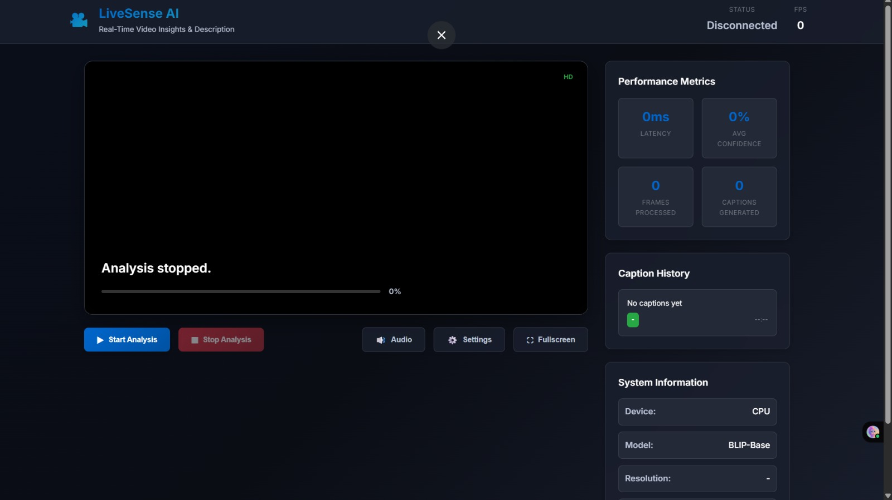
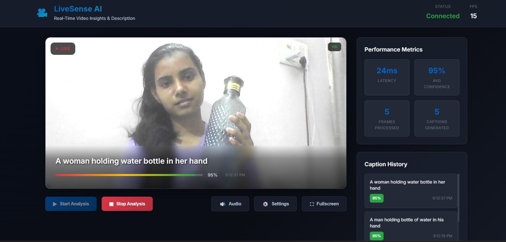
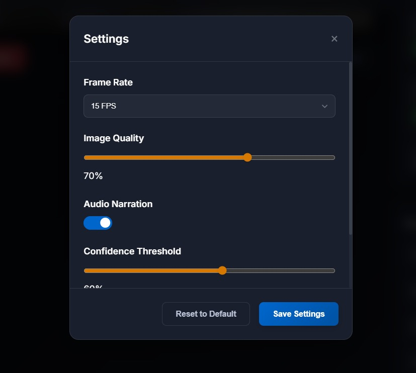
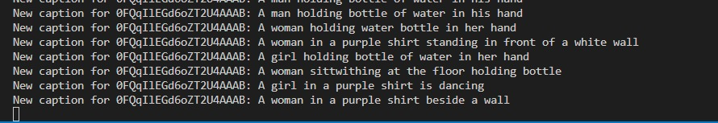
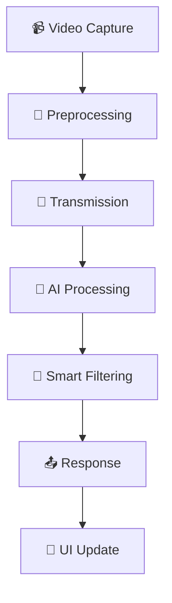

# 🎥 Real-Time Video Captioning System

> 🤖 AI-powered live video captioning with BLIP model integration

[](https://python.org)
[](https://flask.palletsprojects.com)
[](https://pytorch.org)
[](LICENSE)

A sophisticated AI-powered application that generates live captions for webcam video streams using the BLIP (Bootstrapping Language-Image Pre-training) model with advanced optimization techniques.

---

## ✨ Features

<details>
<summary>🔥 Core Functionality</summary>

- 📹 **Real-time Video Processing**: Live webcam feed with continuous caption generation
- 🧠 **AI-Powered Captioning**: BLIP model integration for accurate scene description  
- ⚡ **Smart Frame Processing**: Adaptive frame skipping and scene change detection
- 🚀 **Performance Optimization**: Advanced caching, threading, and memory management
- 🎯 **Scene Change Detection**: Intelligent caption updates based on visual changes
</details>

<details>
<summary>🎨 User Interface</summary>

- 📺 **Live Video Overlay**: Real-time captions displayed over video feed
- 📊 **Performance Metrics**: FPS counter, latency tracking, confidence scores
- 📜 **Caption History**: Chronological list of generated captions
- 🎛️ **Interactive Controls**: Start/stop, settings, audio narration, fullscreen
- 📱 **Responsive Design**: Modern dark theme with mobile optimization
</details>

<details>
<summary>🔧 Advanced Features</summary>

- 🔊 **Audio Narration**: Text-to-speech for generated captions
- 🧩 **Contextual Processing**: Caption enhancement with temporal awareness
- ⚙️ **Configurable Settings**: Adjustable frame rate, quality, and thresholds
- 💾 **Smart Caching**: LRU cache system for performance optimization
</details>

---

## 🛠️ Technology Stack

### 🖥️ Backend
```
🐍 Python Flask + SocketIO    → Real-time server
🤖 BLIP Model                → AI caption generation  
⚡ PyTorch + CUDA            → GPU-accelerated inference
🎯 OpenCV + PIL              → Image processing
🧵 Thread Pool Executor      → Concurrent processing
```

### 🌐 Frontend  
```
🌟 HTML5 + CSS3 + JavaScript → Modern web interface
🔌 Socket.IO Client          → Real-time communication
📹 WebRTC getUserMedia       → Video capture
🎨 Custom Responsive Design  → Glassmorphism UI
```

---

## 🚀 Quick Start

### 📋 Prerequisites

<details>
<summary>Click to expand requirements</summary>

- 🐍 Python 3.8+
- 🎮 CUDA-compatible GPU (recommended)
- 🌐 Modern web browser with WebRTC support
- 📹 Webcam access

</details>

### ⚡ Installation

```bash
# 📂 Clone the repository
git clone https://github.com/Varsha-1605/Real-Time-Video-Captioning-Project.git
cd Real-Time-Video-Captioning-Project

# 📦 Install dependencies
pip install -r requirements.txt

# 🚀 Run the application
python app.py

# 🌐 Open browser
# Navigate to http://localhost:5000
```

### 📦 Dependencies
<details>
<summary>View full requirements.txt</summary>

```txt
numpy                    # 🔢 Numerical computing
torch                    # 🔥 Deep learning framework
torchvision             # 👁️ Computer vision utilities
flask                   # 🌐 Web framework
flask_socketio          # ⚡ Real-time communication
pillow                  # 🖼️ Image processing
opencv-python           # 📹 Computer vision
transformers            # 🤗 NLP models
accelerate              # ⚡ Model acceleration
opencv-contrib-python   # 📹 Extended OpenCV
ultralytics             # 🎯 YOLO models
gunicorn               # 🦄 WSGI server
python-engineio        # 🔌 Engine.IO server
gevent-websocket       # 🌐 WebSocket support
opencv-python-headless # 📹 Headless OpenCV
```

</details>

---
## 📸 Demo

### 🖼️ Application Screenshots

<div align="center">

#### 🎬 Main Interface

*Real-time video captioning with live webcam feed and caption overlay*

#### 📊 Performance Dashboard

*Monitor FPS, latency, and caption confidence in real-time*

#### ⚙️ Settings Panel

*Customize frame rate, quality, and captioning preferences*

#### 📊 logs


</div>

---

## 🎮 Usage Guide

### 🎯 Getting Started

<details>
<summary>Step-by-step guide</summary>

1. 🚀 Launch the application and open the web interface
2. 📹 Allow webcam permissions when prompted  
3. ▶️ Click "Start Analysis" to begin real-time captioning
4. 👀 View live captions overlaid on your video feed
5. 📊 Monitor performance metrics in the sidebar

</details>

### ⌨️ Keyboard Shortcuts

| Key | Action | Description |
|-----|--------|-------------|
| `Space` | ⏯️ Start/Stop | Toggle analysis on/off |
| `S` | ⚙️ Settings | Open settings modal |
| `M` | 🔊 Mute | Toggle audio narration |
| `F` | ⛶ Fullscreen | Enter/exit fullscreen |

### 🔧 Settings Configuration

<details>
<summary>Customize your experience</summary>

- 📊 **Frame Rate**: 10-30 FPS (adjusts processing frequency)
- 🎨 **Image Quality**: 30-90% (compression level for transmission)  
- 🔊 **Audio Narration**: Enable/disable text-to-speech
- 🎯 **Confidence Threshold**: Minimum confidence for caption updates

</details>

---

## 🏗️ Architecture

### 🔄 System Design
```
┌─────────────────┐    📡 WebSocket    ┌──────────────────┐
│   🌐 Frontend   │ ◄──────────────►   │   🖥️ Backend     │
│   (Browser)     │                    │   (Flask+BLIP)   │
├─────────────────┤                    ├──────────────────┤
│ 📹 Video Capture│                    │ 🎯 Frame Process │
│ 🎨 UI Updates   │                    │ 🤖 AI Inference  │
│ 🎛️ User Controls│                    │ 💾 Caching       │
└─────────────────┘                    └──────────────────┘
```

### 🧩 Key Components

<details>
<summary>🖥️ Backend (app.py)</summary>

- 📹 **Frame Processing Pipeline**: Smart buffering and preprocessing
- 🤖 **BLIP Model Integration**: Optimized inference with GPU acceleration  
- 📊 **Performance Monitoring**: Real-time metrics collection
- 💾 **Caching System**: LRU cache for repeated scenes
- 🧵 **Thread Pool**: Concurrent processing for scalability

</details>

<details>
<summary>🌐 Frontend Components</summary>

- 📹 **Video Handler**: Webcam capture and frame extraction
- 🔌 **Socket Manager**: Real-time communication with backend
- 🎨 **UI Controller**: Dynamic interface updates and user interactions  
- 📊 **Performance Tracker**: Client-side metrics and monitoring

</details>

### 🔄 Processing Flow



1. 📹 **Video Capture**: Extract frames from webcam at configurable rate
2. 🎨 **Preprocessing**: Resize, enhance, and encode frames
3. 📡 **Transmission**: Send frame data via WebSocket
4. 🤖 **AI Processing**: BLIP model generates caption with confidence
5. 🎯 **Smart Filtering**: Scene change detection and caption optimization
6. 📤 **Response**: Return caption with metadata to frontend
7. 🎨 **UI Update**: Display caption with performance metrics

---

## ⚙️ Configuration

### 🌍 Environment Variables
```bash
# 🎯 Optional: Customize server settings
FLASK_ENV=production
CUDA_VISIBLE_DEVICES=0
```

### 🚀 Performance Tuning

<details>
<summary>Advanced configuration options</summary>

```python
# 📊 Core Settings
FRAME_SKIP = 3                    # 📹 Frame processing frequency
IMAGE_SIZE = 224                  # 🖼️ Model input resolution  
CACHE_SIZE = 500                  # 💾 Number of cached captions
MAX_WORKERS = 6                   # 🧵 Thread pool size

# 🔧 Advanced Settings
ADAPTIVE_QUALITY = True           # 🎨 Enable image enhancement
MIN_PROCESSING_INTERVAL = 0.1     # ⏱️ Minimum time between frames
SCENE_CHANGE_THRESHOLD = 0.15     # 🎯 Sensitivity for scene detection
CAPTION_HISTORY_SIZE = 10         # 📜 Context buffer size
```

</details>

---

## 📊 Performance Metrics

### ⚡ Typical Performance
| Metric | Value | Description |
|--------|-------|-------------|
| 🕒 **Processing Latency** | 200-800ms | Per frame processing time |
| 📊 **Frame Rate** | 5-15 FPS | Adaptive based on hardware |
| 💾 **Memory Usage** | ~800MB RAM, ~2GB GPU | System resources |
| ⚙️ **CPU Utilization** | 15-30% | On modern systems |
| 📝 **Caption Updates** | 2-second intervals | Refresh frequency |

### 🚀 Optimization Features

<details>
<summary>Performance enhancements</summary>

- ⚡ **Adaptive Frame Skipping**: Dynamically adjusts based on processing speed
- 🎯 **Scene Change Detection**: Reduces redundant processing  
- 💾 **Smart Caching**: Reuses captions for similar scenes
- 📦 **Batch Processing**: Efficient tensor operations
- 🧹 **Memory Management**: Automatic cleanup and garbage collection

</details>

---

## 🛡️ API Reference

### 🌐 REST Endpoints

<details>
<summary>Available endpoints</summary>

| Method | Endpoint | Description |
|--------|----------|-------------|
| `GET` | `/` | 🏠 Main application interface |
| `GET` | `/status` | 📊 Server status and configuration |
| `GET` | `/metrics` | 📈 Detailed performance metrics |
| `POST` | `/clear_cache` | 🗑️ Reset caption cache |
| `GET\|POST` | `/config` | ⚙️ Dynamic configuration management |

</details>

### 🔌 WebSocket Events

<details>
<summary>Real-time communication</summary>

| Event | Direction | Description |
|-------|-----------|-------------|
| `connect` | 📥 Server | Client connection established |
| `disconnect` | 📥 Server | Client disconnection |
| `image` | 📤 Client | Frame data transmission |
| `caption` | 📥 Server | Caption response with metadata |

</details>

---

## 🔧 Troubleshooting

### 🚨 Common Issues

<details>
<summary>📹 Webcam Access Denied</summary>

**Solutions:**
- ✅ Ensure browser permissions are granted
- ⚙️ Check system privacy settings  
- 🔄 Verify webcam is not in use by other applications
- 🌐 Try a different browser

</details>

<details>
<summary>⚡ Poor Performance</summary>

**Solutions:**  
- 📊 Reduce frame rate in settings
- 🎨 Lower image quality setting
- 🎮 Check GPU availability and drivers
- 📊 Monitor system resource usage

</details>

<details>
<summary>🔌 Connection Issues</summary>

**Solutions:**
- ✅ Verify server is running on correct port
- 🛡️ Check firewall settings
- 🌐 Ensure WebSocket support in browser  
- 🔍 Review browser console for errors

</details>

<details>
<summary>📝 Caption Quality Issues</summary>

**Solutions:**
- 💡 Ensure adequate lighting conditions
- 🎯 Adjust confidence threshold in settings
- 🗑️ Clear cache to reset model state
- ✅ Verify BLIP model downloaded correctly

</details>

### 🐛 Debug Mode
```python
# Enable debug logging
app.debug = True
socketio.run(app, debug=True)
```

---

## 🤝 Contributing

### 🛠️ Development Setup

<details>
<summary>Get started with development</summary>

1. 🍴 Fork the repository
2. 🌿 Create feature branch  
3. 📦 Install development dependencies
4. ✅ Make changes with tests
5. 📤 Submit pull request

</details>

### 📏 Code Style
- 🐍 Follow PEP 8 for Python code
- 📝 Use meaningful variable names  
- 📚 Add docstrings for functions
- 🎨 Maintain consistent formatting

---

## 🙏 Acknowledgments

- 🤖 **BLIP Model**: [Salesforce Research team](https://github.com/salesforce/BLIP)
- 🔥 **PyTorch**: [Facebook AI Research](https://pytorch.org)
- 🌐 **Flask-SocketIO**: [Miguel Grinberg](https://github.com/miguelgrinberg/Flask-SocketIO)
- 🤗 **Transformers**: [Hugging Face team](https://huggingface.co/transformers)

---

## 🚀 Future Enhancements

<details>
<summary>Roadmap for upcoming features</summary>

- 🌍 **Multi-language caption support**
- 🎯 **Object detection integration**  
- ☁️ **Cloud deployment options**
- 📱 **Mobile app development**
- 🔄 **Real-time translation features**
- ♿ **Enhanced accessibility options**

</details>

---

## 💬 Support

<details>
<summary>Get help and support</summary>

- 🐛 **Bug Reports**: [Open an issue](https://github.com/Varsha-1605/Real-Time-Video-Captioning-Project/issues)
- 💡 **Feature Requests**: [Start a discussion](https://github.com/Varsha-1605/Real-Time-Video-Captioning-Project/discussions)
- 📧 **Contact**: [Email me](mailto:varshadewangan1605@gmail.com)
- 📚 **Documentation**: [Visit the repository](https://github.com/Varsha-1605/Real-Time-Video-Captioning-Project)

</details>

---

<div align="center">

### 🌟 Star this repo if you found it helpful!

**Made with ❤️ by Varsha**

[](https://github.com/Varsha-1605/Real-Time-Video-Captioning-Project/stargazers)
[](https://github.com/Varsha-1605/Real-Time-Video-Captioning-Project/network)

</div>
